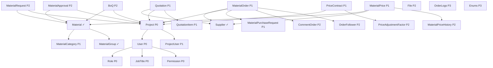

# Kế Hoạch Migration: Thêm 23 PCU Models vào Twenty

**Ngày tạo:** 12/11/2025  
**Dự án:** PCU-Server → Twenty Standard Objects  
**Tổng số models:** 23  
**Ước tính thời gian:** 8-12 tuần (1-2 models/tuần)

---

## 📊 Tổng Quan

### Models Cần Thêm (23)

✅ **Đã có trong Twenty (6):**
- `inventory` ✓
- `manufacturer` ✓
- `material` ✓
- `material_group` ✓
- `supplier` ✓
- `warehouse` ✓

❌ **Cần Thêm (23):**
1. `boq` - Bill of Quantities
2. `comment_order` - Bình luận đơn hàng
3. `enums` - Enumerations
4. `file` - Quản lý file
5. `job_title` - Chức danh
6. `material_approval` - Phê duyệt vật tư
7. `material_category` - Danh mục vật tư
8. `material_order` - Đơn hàng vật tư
9. `material_price` - Giá vật tư
10. `material_price_history` - Lịch sử giá
11. `material_purchase_request` - Yêu cầu mua
12. `material_request` - Yêu cầu vật tư
13. `order_follower` - Người theo dõi đơn hàng
14. `order_logs` - Logs đơn hàng
15. `permission` - Quyền hạn
16. `price_adjustment_factor` - Hệ số điều chỉnh giá
17. `price_contract` - Hợp đồng giá
18. `project` - Dự án
19. `project_user` - Người dùng trong dự án
20. `quotation` - Báo giá
21. `quotation_item` - Item báo giá
22. `role` - Vai trò
23. `user` - Người dùng

---

## 🎯 Chiến Lược Migration

### Nguyên Tắc Ưu Tiên

**Priority Levels:**
- **P0 (Critical):** Core entities - Cần có trước
- **P1 (High):** Business objects - Chức năng chính
- **P2 (Medium):** Supporting objects - Hỗ trợ
- **P3 (Low):** Optional objects - Có thể sau

### Dependency Graph



---

## 📋 Migration Phases (7 Giai Đoạn)

### **Phase 1: Core Foundation (Tuần 1-2)** - P0
**Mục tiêu:** Setup core entities cho authentication & authorization

#### 1.1. User (Tuần 1) ⏱️ 3-4 giờ
**Dependencies:** Role, JobTitle  
**Complexity:** ⭐⭐⭐ Medium-High

**Fields từ PCU:**
- `mail` (TEXT, unique) - Email
- `isActive` (BOOLEAN) - Trạng thái
- `role_id` (RELATION) → Role
- `display_name` (TEXT) - Tên hiển thị
- `jobTitle_id` (RELATION) → JobTitle

**Relations:**
- Many-to-One: User → Role
- Many-to-One: User → JobTitle
- One-to-Many: User ← ProjectUser
- One-to-Many: User ← OrderFollower
- Many-to-Many: User ↔ Project (commanders, supply_users)

**Timeline:** ✅ Yes (Critical for audit)

**Notes:**
- ⚠️ Conflict với Twenty's `workspaceMember` - Cần mapping strategy
- Có thể extend WorkspaceMember thay vì tạo mới
- Cân nhắc sync với Azure AD

**Checklist:**
- [ ] Tạo UUIDs (1 object + ~8 fields + timeline)
- [ ] Update 4 constants files
- [ ] Create `user.workspace-entity.ts`
- [ ] Define fields: mail, isActive, displayName
- [ ] Add relations: role, jobTitle
- [ ] Timeline integration
- [ ] Register backend
- [ ] Frontend: CoreObjectNameSingular, navigation
- [ ] Build & sync
- [ ] Test CRUD, relations, search

---

#### 1.2. Role (Tuần 1) ⏱️ 2-3 giờ
**Dependencies:** Permission  
**Complexity:** ⭐⭐ Medium

**Fields từ PCU:**
- `role_name` (TEXT) - Tên vai trò
- `role_code` (TEXT) - Mã vai trò
- `description` (TEXT) - Mô tả
- `work_group` (TEXT) - Phạm vi công việc

**Relations:**
- Many-to-Many: Role ↔ Permission
- One-to-Many: Role ← User

**Timeline:** ✅ Yes

**Notes:**
- Cấu trúc RBAC cơ bản
- Tích hợp với Permission system

**Checklist:**
- [ ] UUIDs generation
- [ ] Constants files
- [ ] Entity file với fields
- [ ] Relations: permissions (M2M), users (O2M)
- [ ] Timeline
- [ ] Register & frontend
- [ ] Migration & testing

---

#### 1.3. Permission (Tuần 1) ⏱️ 2 giờ
**Dependencies:** None  
**Complexity:** ⭐ Simple

**Fields từ PCU:**
- `title` (TEXT) - Tên quyền
- `code` (TEXT) - Mã quyền

**Relations:**
- Many-to-Many: Permission ↔ Role

**Timeline:** ✅ Yes (Track permission changes for audit)

**Checklist:**
- [ ] UUIDs
- [ ] Constants
- [ ] Entity với basic fields
- [ ] Relation với Role (M2M)
- [ ] Register
- [ ] Testing

---

#### 1.4. JobTitle (Tuần 1-2) ⏱️ 1-2 giờ
**Dependencies:** None  
**Complexity:** ⭐ Simple

**Fields từ PCU:**
- `title` (TEXT) - Chức danh công việc
- `code` (TEXT) - Mã chức danh công việc

**Relations:**
- One-to-Many: JobTitle ← User

**Timeline:** ✅ Yes (Track job title changes)

**Checklist:**
- [ ] UUIDs (1 object + 2 fields)
- [ ] Constants
- [ ] Entity với 2 basic fields
- [ ] Relation với User
- [ ] Register
- [ ] Testing

---

### **Phase 2: Project Management (Tuần 3-4)** - P0

#### 2.1. Project (Tuần 3) ⏱️ 4-5 giờ
**Dependencies:** User  
**Complexity:** ⭐⭐⭐⭐ High

**Fields từ PCU:**
- `project_code` (TEXT) - Mã dự án
- `project_name` (TEXT) - Tên dự án
- `project_owner_group` (TEXT) - Nhóm chủ đầu tư
- `project_owner_name` (TEXT) - Tên chủ đầu tư
- `contract_number` (TEXT) - Số hợp đồng
- `contract_date` (DATE_TIME) - Ngày hợp đồng
- `contract_file_id` (TEXT) - ID file hợp đồng
- `start_date` (DATE_TIME) - Ngày bắt đầu
- `end_date` (DATE_TIME) - Ngày kết thúc
- `commander_email` (TEXT) - Email chỉ huy trưởng
- `supply_manager_email` (TEXT) - Email cung ứng
- `status` (SELECT) - Trạng thái

**Status Enum:**
```typescript
enum ProjectStatus {
  PREPARING_BID = 'preparing_bid',
  IN_PROGRESS = 'in_progress',
  COMPLETED = 'completed',
  ON_HOLD = 'on_hold',
  CANCELLED = 'cancelled',
}
```

**Relations:**
- One-to-Many: Project ← Warehouse
- One-to-Many: Project ← BoQ
- One-to-Many: Project ← MaterialRequest
- One-to-Many: Project ← MaterialApproval
- One-to-Many: Project ← MaterialPurchaseRequest
- One-to-Many: Project ← MaterialOrder
- One-to-Many: Project ← Material
- One-to-Many: Project ← Quotation
- One-to-Many: Project ← PriceAdjustmentFactor
- Many-to-Many: Project ↔ User (commanders)
- Many-to-Many: Project ↔ User (supply_users)
- Many-to-Many: Project ↔ PriceContract
- One-to-Many: Project ← ProjectUser

**Timeline:** ✅ Yes (Critical)

**Notes:**
- Central entity trong PCU system
- Nhiều relations phức tạp
- Cần mapping với Twenty's existing project concept (nếu có)

**Checklist:**
- [ ] UUIDs (1 object + 15+ fields + timeline)
- [ ] Constants (4 files)
- [ ] Entity với đầy đủ fields
- [ ] Status enum definition
- [ ] Relations với tất cả dependent entities
- [ ] Many-to-Many với User (2 relations)
- [ ] Timeline integration
- [ ] Frontend với icon color
- [ ] Default view (All Projects)
- [ ] Migration & testing relations

---

#### 2.2. ProjectUser (Tuần 3-4) ⏱️ 2 giờ
**Dependencies:** Project, User  
**Complexity:** ⭐⭐ Medium

**Fields từ PCU:**
- `user_id` (RELATION) → User
- `project_id` (RELATION) → Project
- `email` (TEXT) - Email người dùng

**Relations:**
- Many-to-One: ProjectUser → Project (required, unique)
- Many-to-One: ProjectUser → User (required, unique)

**Timeline:** ✅ Yes (Track user assignments to projects)

**Notes:**
- Simple junction table linking users to projects
- Bổ sung thêm M2M relationship giữa User và Project

**Checklist:**
- [ ] UUIDs (1 object + 3 fields)
- [ ] Constants
- [ ] Entity với basic fields
- [ ] Relations với User và Project
- [ ] Register
- [ ] Testing M2M relationship

---

### **Phase 3: Material Categorization (Tuần 5)** - P1

#### 3.1. MaterialCategory (Tuần 5) ⏱️ 2-3 giờ
**Dependencies:** Material (already exists)  
**Complexity:** ⭐⭐ Medium

**Fields từ PCU:**
- `material_category_code` (TEXT, unique) - Mã loại vật tư
- `material_category_name` (TEXT) - Tên loại vật tư

**Relations:**
- One-to-Many: MaterialCategory ← Material

**Timeline:** ✅ Yes (Track category changes)

**Notes:**
- Simple lookup/categorization table
- No self-reference (flat structure)

**Checklist:**
- [ ] UUIDs (1 object + 2 fields)
- [ ] Constants
- [ ] Entity với 2 fields (code là unique)
- [ ] Relation với Material
- [ ] Register
- [ ] Testing

---

### **Phase 4: Purchasing Flow (Tuần 6-8)** - P1

#### 4.1. Quotation (Tuần 6) ⏱️ 4-5 giờ
**Dependencies:** Supplier (exists), Project  
**Complexity:** ⭐⭐⭐⭐ High

**Fields từ PCU:**
- `quotation_code` (TEXT) - Mã báo giá
- `quotation_name` (TEXT) - Tên báo giá
- `supplier_quotation_ref` (TEXT) - Số tham chiếu NCC
- `supplier_id` (RELATION) → Supplier
- `project_id` (RELATION) → Project
- `quotation_date` (DATE_TIME) - Ngày báo giá
- `valid_until` (DATE_TIME) - Hiệu lực đến
- `total_amount` (CURRENCY) - Tổng giá trị
- `delivery_fee` (NUMBER) - Phí giao hàng
- `currency` (TEXT) - Đơn vị tiền tệ
- `status` (SELECT) - Trạng thái
- `terms_and_conditions` (TEXT) - Điều khoản
- `note` (TEXT) - Ghi chú
- `received_date` (DATE_TIME) - Ngày nhận
- `received_by` (TEXT) - Người nhận
- `reviewed_by` (TEXT) - Người đánh giá
- `reviewed_date` (DATE_TIME)
- `approved_by` (TEXT) - Người phê duyệt
- `approved_date` (DATE_TIME)
- `approval_note` (TEXT)
- `negotiation_note` (TEXT)
- `negotiation_by` (TEXT)
- `negotiation_date` (DATE_TIME)
- `revision_count` (NUMBER) - Số lần chỉnh sửa
- `selection_note` (TEXT)
- `delivery_time` (TEXT)
- `payment_terms` (TEXT)
- `warranty_period` (TEXT)
- `file_id` (TEXT)

**Status Enum:**
```typescript
enum QuotationStatus {
  RECEIVED = 'received',
  UNDER_REVIEW = 'under_review',
  NEGOTIATING = 'negotiating',
  APPROVED = 'approved',
  REJECTED = 'rejected',
  EXPIRED = 'expired',
}
```

**Relations:**
- Many-to-One: Quotation → Supplier (required)
- Many-to-One: Quotation → Project
- One-to-Many: Quotation ← QuotationItem

**Timeline:** ✅ Yes

**Checklist:**
- [ ] UUIDs (30+ fields + timeline!)
- [ ] Constants
- [ ] Entity với tất cả fields
- [ ] Status enum
- [ ] Relations
- [ ] Timeline
- [ ] Frontend view
- [ ] Testing workflow: receive → review → negotiate → approve

---

#### 4.2. QuotationItem (Tuần 6) ⏱️ 2-3 giờ
**Dependencies:** Quotation, MaterialPurchaseRequest  
**Complexity:** ⭐⭐⭐ Medium

**Fields từ PCU:**
- `quotation_id` (RELATION) → Quotation (required)
- `quantity` (NUMBER) - Số lượng
- `unit_price` (CURRENCY) - Đơn giá
- `total_price` (CURRENCY) - Thành tiền
- `currency` (TEXT) - Đơn vị tiền tệ (default: VND)
- `status` (SELECT) - Trạng thái vật tư
- `negotiated_unit_price` (CURRENCY) - Đơn giá sau thương thảo
- `negotiated_total_price` (CURRENCY) - Thành tiền sau thương thảo
- `negotiation_note` (TEXT) - Ghi chú thương thảo
- `negotiated_by` (TEXT) - Người thương thảo
- `negotiation_date` (DATE_TIME) - Ngày thương thảo
- `accepted_by` (TEXT) - Người chấp nhận giá
- `accepted_date` (DATE_TIME) - Ngày chấp nhận
- `acceptance_note` (TEXT) - Ghi chú chấp nhận
- `delivery_time` (TEXT) - Thời gian giao hàng
- `warranty_period` (TEXT) - Thời gian bảo hành
- `note` (TEXT) - Ghi chú
- `purchase_request_id` (RELATION) → MaterialPurchaseRequest

**Status Enum:**
```typescript
enum QuotationItemStatus {
  PENDING = 'pending',
  UNDER_NEGOTIATION = 'under_negotiation',
  NEGOTIATION_ACCEPTED = 'negotiation_accepted',
  NEGOTIATION_REJECTED = 'negotiation_rejected',
  PRICE_ACCEPTED = 'price_accepted',
  PRICE_REJECTED = 'price_rejected',
  SELECTED = 'selected',
  NOT_SELECTED = 'not_selected',
}
```

**Relations:**
- Many-to-One: QuotationItem → Quotation (required, unique)
- Many-to-One: QuotationItem → MaterialPurchaseRequest (unique)

**Timeline:** ✅ Yes (Track price negotiations and changes)

**Checklist:**
- [ ] UUIDs (18+ fields)
- [ ] Constants + enum
- [ ] Entity với all fields
- [ ] Relations
- [ ] Register
- [ ] Testing negotiation workflow

---

#### 4.3. MaterialPurchaseRequest (Tuần 7) ⏱️ 4-5 giờ
**Dependencies:** Material, Project, MaterialOrder, MaterialRequest  
**Complexity:** ⭐⭐⭐⭐ High (40+ fields!)

**Fields từ PCU:**
- `purchase_request_code` (TEXT) - Mã yêu cầu mua
- `purchase_request_name` (TEXT) - Tên yêu cầu mua
- `material_request_id` (RELATION) → MaterialRequest
- `material_id` (RELATION) → Material
- `supplier_id` (RELATION) → Supplier
- `project_id` (RELATION) → Project
- `requested_quantity` (NUMBER) - Số lượng yêu cầu
- `inventory_quantity` (NUMBER) - Số lượng tồn kho
- `shortage_quantity` (NUMBER) - Số lượng thiếu hụt
- `purchase_quantity` (NUMBER) - Số lượng cần mua
- `approved_quantity` (NUMBER) - Số lượng được phê duyệt
- `actual_received_quantity` (NUMBER) - Số lượng nhận thực tế (default: 0)
- `priority` (SELECT) - Mức độ ưu tiên
- `status` (SELECT) - Trạng thái yêu cầu
- `requested_by` (TEXT) - Người yêu cầu
- `approved_by` (TEXT) - Người phê duyệt
- `request_date` (DATE_TIME) - Ngày yêu cầu
- `required_date` (DATE_TIME) - Ngày cần giao
- `approved_date` (DATE_TIME) - Ngày phê duyệt
- `approval_note` (TEXT) - Ghi chú phê duyệt
- `unit_price` (CURRENCY) - Đơn giá
- `total_amount` (CURRENCY) - Tổng giá
- `amount_paid` (NUMBER) - Số tiền đã thanh toán
- `order_id` (RELATION) → MaterialOrder
- `note` (TEXT) - Ghi chú
- `recommended_supplier_id` (TEXT) - ID nhà cung cấp đề xuất
- `recommended_quotation_id` (TEXT) - ID báo giá đề xuất
- `recommended_quotation_item_id` (TEXT) - ID báo giá item đề xuất
- `procurement_department_approval_status` (SELECT) - Trạng thái phê duyệt của Trưởng phòng Cung ứng
- `procurement_department_note` (TEXT) - Ghi chú của Trưởng phòng Cung ứng
- `procurement_department_approval_date` (DATE_TIME) - Thời gian duyệt
- `supplier_list` (RAW_JSON) - Danh sách nhà cung cấp (array)

**Enums:**
```typescript
enum MaterialPurchaseRequestStatus {
  WAITING_FOR_QUOTATION = 'waiting_for_quotation',
  QUOTATION_RECEIVED = 'quotation_received',
  QUOTATION_UNDER_NEGOTIATION = 'quotation_under_negotiation',
  SUPPLIER_APPROVED = 'supplier_approved',
  READY_FOR_ORDER = 'ready_for_order',
}

enum ProcurementDepartmentApprovalStatus {
  ACCEPTED = 'accepted',
  REJECTED = 'rejected',
}

// Reuse PriorityEnum from MaterialOrder
```

**Relations:**
- Many-to-One: → MaterialRequest (unique)
- Many-to-One: → Project (unique)
- Many-to-One: → Supplier (unique)
- Many-to-One: → MaterialOrder (unique)
- Many-to-One: → Material (unique)
- One-to-Many: ← QuotationItem

**Timeline:** ✅ Yes

**Notes:**
- Entity phức tạp nhất với 30+ fields
- Workflow approval nhiều tầng
- JSON field cho supplier list

**Checklist:**
- [ ] UUIDs (1 object + 30+ fields + timeline)
- [ ] Constants + 2 enums
- [ ] Entity với tất cả fields
- [ ] Handle JSON field (supplier_list)
- [ ] Relations (6 M2O + 1 O2M)
- [ ] Timeline integration
- [ ] Register & frontend
- [ ] Test complex approval workflow

---

#### 4.4. MaterialOrder (Tuần 7-8) ⏱️ 4-5 giờ
**Dependencies:** Supplier, Project, MaterialPurchaseRequest  
**Complexity:** ⭐⭐⭐⭐ High

**Fields từ PCU:**
- `order_code` (TEXT) - Mã đơn hàng
- `next_approver` (SELECT) - Người phê duyệt tiếp theo
- `supplier_id` (RELATION) → Supplier
- `project_id` (RELATION) → Project
- `priority` (SELECT) - Mức độ ưu tiên
- `purchase_approval_status` (SELECT) - Trạng thái phê duyệt
- `created_by` (TEXT) - Người yêu cầu
- `approved_by` (TEXT) - Người phê duyệt
- `next_approved_by` (TEXT)
- `approved_date` (DATE_TIME)
- `external_reference` (TEXT) - Mã tham chiếu ngoài
- `order_name` (TEXT)
- `approval_note` (TEXT)
- `total_amount` (CURRENCY)
- `amount_paid` (NUMBER)
- `payment_method` (TEXT)
- `quotation_file` (TEXT)
- `reference_document_link` (LINK)
- `note` (TEXT)

**Enums:**
```typescript
enum MaterialOrderApprovalStatus {
  PENDING = 'pending',
  COMMANDER_APPROVED = 'commander_approved',
  SUPPLY_APPROVED = 'supply_approved',
  APPROVED = 'approved',
  REJECTED = 'rejected',
}

enum Priority {
  LOW = 'low',
  MEDIUM = 'medium',
  HIGH = 'high',
  URGENT = 'urgent',
}
```

**Relations:**
- Many-to-One: → Supplier
- Many-to-One: → Project
- One-to-Many: ← MaterialPurchaseRequest
- One-to-Many: ← CommentOrder
- One-to-Many: ← OrderFollower

**Timeline:** ✅ Yes

**Checklist:**
- [ ] UUIDs
- [ ] Constants + enums
- [ ] Entity với approval workflow fields
- [ ] Relations
- [ ] Timeline
- [ ] Frontend với approval UI
- [ ] Test approval flow

---

### **Phase 5: Material Pricing (Tuần 9)** - P1

#### 5.1. MaterialPrice (Tuần 9) ⏱️ 3-4 giờ
**Dependencies:** Material, Supplier, Manufacturer, PriceContract  
**Complexity:** ⭐⭐⭐ Medium-High

**Fields từ PCU:**
- `material_id` (RELATION) → Material (required)
- `supplier_id` (RELATION) → Supplier (required)
- `model` (TEXT) - Model thiết bị
- `unit` (TEXT) - Đơn vị tính
- `current_price` (CURRENCY) - Giá hiện tại (default: 0)
- `labor_cost` (CURRENCY) - Giá nhân công (default: 0)
- `manufacturer_id` (RELATION) → Manufacturer
- `lead_time_min_days` (NUMBER) - Thời gian giao tối thiểu (ngày)
- `lead_time_max_days` (NUMBER) - Thời gian giao tối đa (ngày)
- `price_updated_at` (DATE_TIME) - Ngày cập nhật giá
- `discount_percentage` (NUMBER) - Phần trăm chiết khấu
- `note` (TEXT) - Ghi chú
- `price_contract_id` (RELATION) → PriceContract
- `price_type` (SELECT) - Loại giá: quotation hoặc contract

**Enum:**
```typescript
enum MaterialPriceType {
  CONTRACT = 'contract',
  QUOTATION = 'quotation',
}
```

**Relations:**
- Many-to-One: → Material (required, unique)
- Many-to-One: → Supplier (required, unique)
- Many-to-One: → Manufacturer (unique)
- Many-to-One: → PriceContract (unique)
- One-to-Many: ← MaterialPriceHistory

**Timeline:** ✅ Yes

**Checklist:**
- [ ] UUIDs (15+ fields + timeline)
- [ ] Constants + enum
- [ ] Entity với pricing fields
- [ ] Relations (4 M2O + 1 O2M)
- [ ] Timeline
- [ ] Register
- [ ] Test price tracking

---

#### 5.2. MaterialPriceHistory (Tuần 9) ⏱️ 2 giờ
**Dependencies:** MaterialPrice  
**Complexity:** ⭐⭐ Medium

**Fields từ PCU:**
- `material_price_id` (RELATION) → MaterialPrice (required)
- `old_price` (CURRENCY) - Giá cũ (default: 0)
- `new_price` (CURRENCY) - Giá mới (default: 0)
- `changed_at` (DATE_TIME) - Thời gian thay đổi
- `changed_by` (TEXT) - Người thay đổi
- `file_id` (TEXT) - ID file
- `reason` (TEXT) - Lý do

**Relations:**
- Many-to-One: → MaterialPrice (required, unique)

**Timeline:** ✅ Yes (Track who changed prices and when)

**Checklist:**
- [ ] UUIDs (7 fields)
- [ ] Constants
- [ ] Entity với audit fields
- [ ] Relation with MaterialPrice
- [ ] Register
- [ ] Test price change tracking

---

#### 5.3. PriceContract (Tuần 9) ⏱️ 3-4 giờ
**Dependencies:** Supplier, Project  
**Complexity:** ⭐⭐⭐ Medium-High

**Fields từ PCU:**
- `contract_code` (TEXT, unique) - Mã hợp đồng
- `supplier_id` (RELATION) → Supplier (required)
- `contract_name` (TEXT) - Tên hợp đồng
- `start_date` (DATE_TIME) - Ngày bắt đầu hiệu lực
- `end_date` (DATE_TIME) - Ngày hết hạn
- `status` (SELECT) - Trạng thái hợp đồng
- `description` (TEXT) - Mô tả hợp đồng
- `created_by` (TEXT) - Người tạo
- `approved_by` (TEXT) - Người phê duyệt
- `approved_at` (DATE_TIME) - Thời gian phê duyệt
- `terms_and_conditions` (TEXT) - Điều khoản và điều kiện

**Enum:**
```typescript
enum PriceContractStatus {
  DRAFT = 'draft',
  ACTIVE = 'active',
  EXPIRED = 'expired',
  CANCELLED = 'cancelled',
}
```

**Relations:**
- Many-to-One: → Supplier (required, unique)
- One-to-Many: ← MaterialPrice
- Many-to-Many: ↔ Project

**Timeline:** ✅ Yes

**Checklist:**
- [ ] UUIDs (11 fields + timeline)
- [ ] Constants + enum
- [ ] Entity với contract fields
- [ ] M2O với Supplier
- [ ] M2M với Project
- [ ] O2M với MaterialPrice
- [ ] Timeline
- [ ] Register
- [ ] Test contract lifecycle

---

### **Phase 6: Material Requests & Approvals (Tuần 10)** - P2

#### 6.1. MaterialRequest (Tuần 10) ⏱️ 3-4 giờ
**Dependencies:** Material, Project, Manufacturer  
**Complexity:** ⭐⭐⭐ Medium-High

**Fields từ PCU:**
- `material_request_code` (TEXT) - Mã yêu cầu vật tư
- `material_id` (RELATION) → Material
- `material_code` (TEXT) - Mã vật tư
- `material_name` (TEXT) - Tên vật tư
- `specification` (TEXT) - Thông số kỹ thuật
- `unit` (TEXT) - Đơn vị
- `project_id` (RELATION) → Project (required)
- `quantity` (NUMBER) - Số lượng
- `requested_date` (DATE_TIME) - Ngày yêu cầu
- `required_date` (DATE_TIME) - Ngày cần giao
- `status` (SELECT) - Trạng thái yêu cầu vật tư
- `request_name` (TEXT) - Tên yêu cầu vật tư
- `category` (TEXT) - Hạng mục
- `requested_by` (TEXT) - Người yêu cầu
- `image` (TEXT) - Hình ảnh minh họa
- `manufacturer_id` (RELATION) → Manufacturer
- `manufacturer_name` (TEXT) - Tên nhà sản xuất
- `note` (TEXT) - Ghi chú

**Enum:**
```typescript
enum MaterialRequestStatus {
  PENDING = 'pending',
  IN_PROGRESS = 'in_progress',
  COMPLETED = 'completed',
}
```

**Relations:**
- Many-to-One: → Project (required, unique)
- Many-to-One: → Material (unique)
- Many-to-One: → Manufacturer (unique)
- One-to-Many: ← MaterialPurchaseRequest

**Timeline:** ✅ Yes

**Checklist:**
- [ ] UUIDs (18 fields + timeline)
- [ ] Constants + enum
- [ ] Entity với request fields
- [ ] Relations
- [ ] Timeline
- [ ] Register
- [ ] Test request workflow

---

#### 6.2. MaterialApproval (Tuần 10) ⏱️ 3 giờ
**Dependencies:** Material, Project, Supplier, Manufacturer  
**Complexity:** ⭐⭐⭐ Medium

**Fields từ PCU:**
- `material_approval_code` (TEXT) - Mã phê duyệt vật tư
- `material_approval_name` (TEXT) - Tên phê duyệt vật tư
- `material_id` (RELATION) → Material (required)
- `project_id` (RELATION) → Project (required)
- `status` (SELECT) - Trạng thái (default: pending)
- `approved_date` (DATE_TIME) - Ngày phê duyệt
- `attachment` (TEXT) - File đính kèm
- `supplier_id` (RELATION) → Supplier
- `manufacturer_id` (RELATION) → Manufacturer
- `note` (TEXT) - Ghi chú

**Enum:**
```typescript
enum MaterialApprovalStatus {
  APPROVED = 'approved',
  REJECTED = 'rejected',
  PENDING = 'pending',
}
```

**Relations:**
- Many-to-One: → Project (required, unique)
- Many-to-One: → Material (required, unique)
- Many-to-One: → Supplier (unique)
- Many-to-One: → Manufacturer (unique)

**Timeline:** ✅ Yes

**Checklist:**
- [ ] UUIDs (10 fields + timeline)
- [ ] Constants + enum
- [ ] Entity với approval fields
- [ ] Relations (4 M2O)
- [ ] Timeline
- [ ] Register
- [ ] Test approval workflow

---

#### 6.3. BoQ (Tuần 10) ⏱️ 3-4 giờ
**Dependencies:** Material, Project, Manufacturer  
**Complexity:** ⭐⭐⭐⭐ High (30+ fields!)

**Fields từ PCU:**
- `classification` (TEXT) - Phân loại (default: "")
- `type` (SELECT) - Loại BOQ: draft/actual/tender (default: actual)
- `material_id` (RELATION) → Material
- `project_id` (RELATION) → Project (required)
- `description` (TEXT) - Mô tả
- `technical_specs` (TEXT) - Thông số kỹ thuật
- `model` (TEXT) - Mô hình
- `image` (TEXT) - Hình ảnh minh họa
- `unit` (TEXT) - Đơn vị
- `manufacturer_id` (RELATION) → Manufacturer
- `origin` (TEXT) - Xuất xứ
- `quantity` (NUMBER) - Số lượng (default: 0)
- `unit_price` (CURRENCY) - Đơn giá (default: 0)
- `labor_cost` (CURRENCY) - Chi phí nhân công (default: 0)
- `material_total_price` (CURRENCY) - Thành tiền vật tư (default: 0)
- `labor_total_price` (CURRENCY) - Thành tiền nhân công (default: 0)
- `total_price` (CURRENCY) - Tổng giá (default: 0)
- `amount` (CURRENCY) - Thành tiền (default: 0)
- `note` (TEXT) - Ghi chú
- `title` (TEXT) - Tiêu đề
- `parent_id` (RELATION) → BoQ (self-reference)
- `created_by` (TEXT) - Người tạo
- `brand` (TEXT) - Thương hiệu

**Enum:**
```typescript
enum BOQType {
  DRAFT = 'draft',
  ACTUAL = 'actual',
  TENDER = 'tender',
}
```

**Relations:**
- Many-to-One: → Project (required, unique)
- Many-to-One: → Material (unique)
- Many-to-One: → Manufacturer (unique)
- Many-to-One: → BoQ (parent, self-reference, unique)
- One-to-Many: ← BoQ (children, self-reference)

**Timeline:** ✅ Yes (Track BoQ modifications and approvals - important for audit)

**Notes:**
- Bill of Quantities - complex hierarchical structure
- Self-referencing for parent-child relationships
- Nhiều calculated fields

**Checklist:**
- [ ] UUIDs (23 fields)
- [ ] Constants + enum
- [ ] Entity với tất cả fields
- [ ] Self-reference relation (parent-child)
- [ ] Relations với Material, Project, Manufacturer
- [ ] Register
- [ ] Test hierarchy structure

---

### **Phase 7: Supporting Features (Tuần 11-12)** - P2-P3

#### 7.1. CommentOrder (Tuần 11) ⏱️ 2 giờ
**Dependencies:** MaterialOrder, User  
**Complexity:** ⭐⭐ Medium

**Fields từ PCU:**
- `content` (TEXT) - Nội dung bình luận
- `order_id` (RELATION) → MaterialOrder (required)
- `created_by` (TEXT) - Người tạo

**Relations:**
- Many-to-One: → MaterialOrder

**Timeline:** ✅ Yes (Track comment creation and modifications)

**Notes:**
- Simple comment/discussion system for orders
- No formal relation to User (uses created_by string)

**Checklist:**
- [ ] UUIDs (3 fields)
- [ ] Constants
- [ ] Entity với comment fields
- [ ] Relation with MaterialOrder
- [ ] Register
- [ ] Test commenting

---

#### 7.2. OrderFollower (Tuần 11) ⏱️ 2 giờ
**Dependencies:** MaterialOrder, User  
**Complexity:** ⭐⭐ Medium

**Fields từ PCU:**
- `order_id` (RELATION) → MaterialOrder (required, unique)
- `user_id` (RELATION) → User (required, unique)
- `action` (SELECT) - Hành động

**Enum:**
```typescript
enum OrderFollowerAction {
  VIEW = 'view',
  APPROVE = 'approve',
}
```

**Relations:**
- Many-to-One: → MaterialOrder (required, unique)
- Many-to-One: → User (required, unique)

**Timeline:** ✅ Yes (Track who follows orders and when)

**Notes:**
- Junction table for order followers/watchers
- Permission-based: view vs approve

**Checklist:**
- [ ] UUIDs (3 fields)
- [ ] Constants + enum
- [ ] Entity
- [ ] Relations (both required + unique)
- [ ] Register
- [ ] Test follower notifications

---

#### 7.3. PriceAdjustmentFactor (Tuần 11) ⏱️ 2-3 giờ
**Dependencies:** Project, MaterialGroup  
**Complexity:** ⭐⭐⭐ Medium

**Fields từ PCU:**
- `project_id` (RELATION) → Project (required)
- `classification` (TEXT) - Phân loại BOQ (ví dụ: CIVIL, MEP)
- `material_group_id` (RELATION) → MaterialGroup (required)
- `factor` (NUMBER) - Hệ số điều chỉnh giá (1.1 = tăng 10%, 0.9 = giảm 10%)
- `description` (TEXT) - Mô tả lý do điều chỉnh
- `is_active` (BOOLEAN) - Trạng thái kích hoạt (default: true)

**Relations:**
- Many-to-One: → Project (required, unique)
- Many-to-One: → MaterialGroup (required, unique)

**Indexes:**
- UNIQUE: (project_id, classification, material_group_id)
- INDEX: (project_id, classification)
- INDEX: (material_group_id)
- INDEX: (is_active)

**Timeline:** ✅ Yes (Track price adjustment factor changes)

**Notes:**
- Complex pricing adjustment logic
- Unique constraint on combination of 3 fields
- Multiple indexes for performance

**Checklist:**
- [ ] UUIDs (6 fields)
- [ ] Constants
- [ ] Entity với adjustment logic
- [ ] Relations
- [ ] **IMPORTANT:** Implement unique constraint decorator
- [ ] **IMPORTANT:** Implement field indexes
- [ ] Register
- [ ] Test factor calculations

---

#### 7.4. File (Tuần 11-12) ⏱️ 2-3 giờ
**Dependencies:** None (Generic)  
**Complexity:** ⭐⭐⭐ Medium

**Fields từ PCU:**
- `localPath` (TEXT) - Đường dẫn local
- `fileName` (TEXT) - Tên file
- `duration` (NUMBER) - Duration (for media files)
- `fileSize` (TEXT) - Kích thước file
- `originalName` (TEXT) - Tên gốc
- `mimeType` (TEXT) - Loại MIME
- `ownerID` (TEXT) - ID người sở hữu
- `s3Key` (TEXT) - Key trên S3
- `azureKey` (TEXT) - Key trên Azure
- `storagePlatform` (SELECT) - Nền tảng lưu trữ (default: s3)

**Enum:**
```typescript
enum StoragePlatform {
  S3 = 's3',
  AZURE = 'azure',
}
```

**Relations:** None (Generic file storage)

**Timeline:** ✅ Yes (Track file uploads and modifications)

**Notes:**
- ⚠️ **CONFLICT:** Twenty đã có Attachment entity
- PCU File hỗ trợ multi-cloud (S3 + Azure)
- Cần quyết định: Reuse Attachment hay tạo File riêng?

**Decision Points:**
1. **Option A:** Map File → Attachment (modify Attachment để support Azure)
2. **Option B:** Tạo File entity riêng (keep both)
3. **Option C:** Merge vào Attachment với polymorphic storage

**Checklist:**
- [ ] **DECISION:** Choose Option A, B, or C
- [ ] UUIDs (nếu tạo mới)
- [ ] Constants + enum
- [ ] Entity (nếu tạo mới) hoặc modify Attachment
- [ ] Register
- [ ] Test file upload/download với S3 và Azure

---

#### 7.5. OrderLogs (Tuần 12) ⏱️ 1-2 giờ
**Dependencies:** MaterialOrder (indirect)  
**Complexity:** ⭐ Simple

**Fields từ PCU:**
- `role_name` (TEXT) - Tên vai trò
- `from` (TEXT) - Người xử lý chính vai trò
- `to` (TEXT) - Người tiếp nhận xử lý
- `order_id` (TEXT) - ID đơn hàng
- `action` (TEXT) - Hành động

**Relations:** None (Audit log table, uses order_id as string)

**Timeline:** ✅ Yes (Track log creation - meta-audit trail)

**Notes:**
- Simple audit log
- No formal foreign key relationship
- Tracks order state transitions

**Checklist:**
- [ ] UUIDs (5 fields)
- [ ] Constants
- [ ] Entity với log fields
- [ ] No relations (audit table)
- [ ] Register
- [ ] Test logging

---

#### 7.6. Enums (Tuần 12) ⏱️ 1 giờ
**Complexity:** ⭐ Simple

**Action Required:**
Extract và document tất cả enums từ PCU, định nghĩa trong TypeScript constants.

**Enums đã xác định:**

1. **StoragePlatform:** s3, azure
2. **Priority:** low, medium, high, urgent
3. **MaterialApprovalStatus:** approved, rejected, pending
4. **OrderFollowerAction:** view, approve
5. **MaterialOrderApprovalStatus:** pending, commander_approved, qc_approved, supplier_approved, director_approved, supplier_staff_approved, paid, received, rejected, cancelled
6. **QuotationStatus:** received, under_review, negotiating, revised, partially_selected, fully_selected, approved, rejected, expired, not_selected
7. **QuotationItemStatus:** pending, under_negotiation, negotiation_accepted, negotiation_rejected, price_accepted, price_rejected, selected, not_selected
8. **MaterialPurchaseRequestStatus:** waiting_for_quotation, quotation_received, quotation_under_negotiation, supplier_approved, ready_for_order
9. **ProcurementDepartmentApprovalStatus:** accepted, rejected
10. **MaterialRequestStatus:** pending, in_progress, completed
11. **PriceContractStatus:** draft, active, expired, cancelled
12. **MaterialPriceType:** contract, quotation
13. **BOQType:** draft, actual, tender
14. **ProjectStatus:** preparing_bid, submitted_bid, negotiating, won_bid, lost_bid, signed_contract, under_construction, completed
15. **Module:** material, boq, project, user, role, material_approval, material_request, material_price, material_order, material_purchase, permission, warehouse, manufacturer, supplier
16. **Action:** create, read_all, update, delete, read_detail, read_not_priced, *, approve

**Checklist:**
- [ ] Tạo file `pcu-enums.constants.ts`
- [ ] Document tất cả enum values
- [ ] Map các enums vào entities tương ứng
- [ ] Review và verify completeness

---

## 📊 Migration Roadmap

### Timeline Overview

```
Tuần 1-2:  Phase 1 - Core Foundation (User, Role, Permission, JobTitle)
Tuần 3-4:  Phase 2 - Project Management (Project, ProjectUser)
Tuần 5:    Phase 3 - Material Categorization (MaterialCategory)
Tuần 6-8:  Phase 4 - Purchasing Flow (Quotation, QuotationItem, MaterialPurchaseRequest, MaterialOrder)
Tuần 9:    Phase 5 - Material Pricing (MaterialPrice, MaterialPriceHistory, PriceContract)
Tuần 10:   Phase 6 - Material Requests (MaterialRequest, MaterialApproval, BoQ)
Tuần 11-12: Phase 7 - Supporting Features (CommentOrder, OrderFollower, PriceAdjustmentFactor, File, OrderLogs, Enums)
```

### Effort Estimation

| Phase | Models | Hours | Weeks |
|-------|--------|-------|-------|
| Phase 1 | 4 | 8-11h | 2 |
| Phase 2 | 2 | 6-7h | 2 |
| Phase 3 | 1 | 2-3h | 1 |
| Phase 4 | 4 | 13-17h | 3 |
| Phase 5 | 3 | 8-9h | 1 |
| Phase 6 | 3 | 8-10h | 1 |
| Phase 7 | 6 | 10-13h | 2 |
| **Total** | **23** | **55-70h** | **12 weeks** |

**Notes:**
- Thời gian trên là ước tính cho 1 người làm part-time (5-6h/tuần)
- Nếu full-time (40h/tuần): ~2 tuần
- Nếu team 2 người: ~3-4 tuần

---

## 🔍 Pre-Migration Tasks

### 1. Schema Analysis (Tuần 0)
**⏱️ COMPLETED ✅**

Đã đọc và phân tích chi tiết tất cả schema files:

✅ Completed:
- [x] `boq.go` - 30+ fields, hierarchical structure
- [x] `comment_order.go` - Simple comment system
- [x] `file.go` - Multi-cloud storage (S3/Azure)
- [x] `job_title.go` - 2 fields only
- [x] `material_approval.go` - Approval workflow
- [x] `material_category.go` - Simple 2-field lookup
- [x] `material_order.go` - Complex approval flow (từ schema trước)
- [x] `material_price.go` - Pricing with contracts
- [x] `material_price_history.go` - Audit trail
- [x] `material_purchase_request.go` - 40+ fields!
- [x] `material_request.go` - Request workflow
- [x] `order_follower.go` - Junction table
- [x] `order_logs.go` - Audit logs
- [x] `permission.go` - Simple 2-field (từ schema trước)
- [x] `price_adjustment_factor.go` - Complex with indexes
- [x] `price_contract.go` - Contract management
- [x] `project_user.go` - Simple junction
- [x] `quotation_item.go` - 18+ fields with negotiation
- [x] `role.go` - 4 fields (từ schema trước)
- [x] `user.go` - 5 fields (từ schema trước)
- [x] `material.go` - Already exists (từ schema trước)
- [x] `project.go` - 15+ fields (từ schema trước)
- [x] `quotation.go` - 30+ fields (từ schema trước)

**Output:** ✅ Kế hoạch đã được cập nhật với fields chính xác

---

### 2. Enums Extraction (Tuần 0)
**⏱️ COMPLETED ✅**

Đã extract tất cả enums từ `enums.go`:

✅ 16 Enums đã xác định:
1. StoragePlatform (2 values)
2. Priority (4 values)
3. MaterialApprovalStatus (3 values)
4. OrderFollowerAction (2 values)
5. MaterialOrderApprovalStatus (10 values!)
6. QuotationStatus (10 values!)
7. QuotationItemStatus (8 values!)
8. MaterialPurchaseRequestStatus (5 values)
9. ProcurementDepartmentApprovalStatus (2 values)
10. MaterialRequestStatus (3 values)
11. PriceContractStatus (4 values)
12. MaterialPriceType (2 values)
13. BOQType (3 values)
14. ProjectStatus (8 values)
15. Module (14 values)
16. Action (8 values)

**Files to create:**
- [ ] `PCU_ENUMS.md` - Document tất cả enums
- [ ] `pcu-enums.constants.ts` - TypeScript constants

---

### 3. Conflict Resolution Strategy (Tuần 0)
**⏱️ 2-3 giờ**

**User vs WorkspaceMember:**
- [ ] So sánh fields User (PCU) vs WorkspaceMember (Twenty)
- [ ] Quyết định: Extend hay tạo mới?
- [ ] Document mapping strategy

**File vs Attachment:**
- [ ] So sánh schema
- [ ] Quyết định: Reuse Attachment hay tạo File riêng?
- [ ] Document polymorphic relations strategy

**Project vs Opportunity:**
- [ ] Twenty có Opportunity, PCU có Project
- [ ] Có thể map Project → Opportunity?
- [ ] Document business logic differences

---

### 4. UUID Generation Script (Tuần 0)
**⏱️ 1 giờ**

Tạo script để generate tất cả UUIDs cần thiết:

```bash
#!/bin/bash
# generate-uuids.sh

echo "# PCU Standard Object UUIDs"
echo ""
echo "## Object IDs"
for model in boq comment_order file job_title material_approval material_category material_order material_price material_price_history material_purchase_request material_request order_follower order_logs permission price_adjustment_factor price_contract project project_user quotation quotation_item role user
do
  uuid=$(uuidgen | tr '[:upper:]' '[:lower:]')
  echo "$model: '$uuid'"
done

echo ""
echo "## Field IDs"
echo "# Generate ~10 UUIDs per object"
# ... generate field UUIDs
```

**Output:** `PCU_UUIDS.md` với tất cả UUIDs

---

## 📝 Per-Object Checklist Template

Sử dụng checklist này cho **MỖI** object:

```markdown
### [Object Name] - Week X

**Status:** 🔴 Not Started | 🟡 In Progress | 🟢 Completed

#### Pre-work
- [ ] Đọc schema file (`[name].go`)
- [ ] Xác định tất cả fields
- [ ] Xác định tất cả relations
- [ ] Xác định enums (nếu có)
- [ ] Check Timeline requirement

#### Step 1: UUIDs & Constants (15-20 min)
- [ ] Generate UUIDs (object + fields + timeline)
- [ ] Update `standard-object-ids.ts`
- [ ] Update `standard-field-ids.ts` (create `[OBJECT]_STANDARD_FIELD_IDS`)
- [ ] Update `standard-object-icons.ts`
- [ ] Update `standard-objects-by-priority-rank.ts`
- [ ] (If timeline) Update `TIMELINE_ACTIVITY_STANDARD_FIELD_IDS`

#### Step 2: Entity Definition (30-45 min)
- [ ] Create module folder: `src/modules/[name]/standard-objects/`
- [ ] Create `[name].workspace-entity.ts`
- [ ] Define `@WorkspaceEntity` decorator
- [ ] Add business fields
- [ ] Add system fields: `position`, `createdBy`
- [ ] (If searchable) Add `searchVector` + `SEARCH_FIELDS_FOR_[OBJECT]`
- [ ] (If has enums) Define enums

#### Step 3: Relations (30-60 min)
- [ ] Import related entities
- [ ] Add Many-to-One relations
- [ ] Add `@WorkspaceJoinColumn` và `[name]Id` fields
- [ ] Add One-to-Many inverse relations
- [ ] Update related entities (bidirectional)
- [ ] Test `inverseSideFieldKey` matching

#### Step 4: Timeline (15-20 min - if needed)
- [ ] Add relation in `timeline-activity.workspace-entity.ts`
- [ ] Use `RelationOnDeleteAction.SET_NULL`
- [ ] Add inverse relation in entity
- [ ] Add `@WorkspaceIsSystem()` decorator
- [ ] Verify `inverseSideFieldKey` matching

#### Step 5: Register Backend (5 min)
- [ ] Import in `standard-objects/index.ts`
- [ ] Add to `standardObjectMetadataDefinitions` array (alphabetically)

#### Step 6: Frontend (15-20 min - optional)
- [ ] Add to `CoreObjectNameSingular.ts`
- [ ] Add to `ORDERED_STANDARD_OBJECTS` (navigation)
- [ ] Add icon color in `getIconColorForObjectType.ts`
- [ ] (Optional) Create default view file

#### Step 7: Migration & Testing (20-30 min)
- [ ] `yarn build` - Check build errors
- [ ] `yarn command:prod workspace:sync-metadata`
- [ ] Verify table created in database
- [ ] Test GraphQL queries
- [ ] Test GraphQL mutations (create, update, delete)
- [ ] Test relations (if any)
- [ ] Test search (if searchable)
- [ ] Test UI (if frontend done)

#### Troubleshooting
- [ ] No build errors
- [ ] No migration errors
- [ ] Timeline errors resolved
- [ ] Relations working bidirectionally
- [ ] Search functional

#### Documentation
- [ ] Update migration log
- [ ] Document special cases
- [ ] Note any deviations from plan
```

---

## 🚨 Risk Management

### High-Risk Items

#### 1. User Entity Conflict
**Risk:** Twenty's WorkspaceMember vs PCU's User  
**Impact:** ⭐⭐⭐⭐⭐ Critical  
**Mitigation:**
- Research Twenty's authentication flow
- Consider extending WorkspaceMember
- Document mapping strategy early
- Get stakeholder buy-in

#### 2. Complex Relations
**Risk:** Circular dependencies, missing entities  
**Impact:** ⭐⭐⭐⭐ High  
**Mitigation:**
- Follow dependency graph strictly
- Test relations incrementally
- Use `@WorkspaceIsNullable()` liberally
- Document relation patterns

#### 3. Timeline Integration
**Risk:** Wrong pattern → server crash  
**Impact:** ⭐⭐⭐⭐ High  
**Mitigation:**
- ALWAYS use `SET_NULL` not `CASCADE`
- Test timeline relations separately
- Follow established pattern exactly
- Verify `inverseSideFieldKey` matching

#### 4. Enum Mismatches
**Risk:** PCU enums không map vào Twenty  
**Impact:** ⭐⭐⭐ Medium  
**Mitigation:**
- Extract all enums early
- Document enum values
- Consider SELECT fields với custom options

#### 5. File/Attachment Duplication
**Risk:** Duplicate functionality  
**Impact:** ⭐⭐ Low-Medium  
**Mitigation:**
- Analyze both schemas early
- Decide reuse vs new entity
- Document polymorphic relation strategy

---

## 📈 Progress Tracking

### Weekly Milestones

**Week 1:**
- [ ] Complete schema analysis
- [ ] Generate all UUIDs
- [ ] Extract enums
- [ ] Resolve User conflict

**Week 2:**
- [ ] User entity migrated
- [ ] Role entity migrated
- [ ] Permission entity migrated
- [ ] JobTitle entity migrated

**Week 3:**
- [ ] Project entity migrated (most complex!)
- [ ] Basic project CRUD working

**Week 4:**
- [ ] ProjectUser migrated
- [ ] Project relations tested

**Week 5:**
- [ ] MaterialCategory migrated
- [ ] Material categorization working

**Week 6:**
- [ ] Quotation migrated
- [ ] QuotationItem migrated

**Week 7-8:**
- [ ] MaterialPurchaseRequest migrated
- [ ] MaterialOrder migrated
- [ ] Approval workflow tested

**Week 9:**
- [ ] MaterialPrice migrated
- [ ] MaterialPriceHistory migrated
- [ ] PriceContract migrated

**Week 10:**
- [ ] MaterialRequest migrated
- [ ] MaterialApproval migrated
- [ ] BoQ migrated

**Week 11-12:**
- [ ] All remaining entities migrated
- [ ] All tests passing
- [ ] Documentation complete

---

## 🎯 Success Criteria

### Per Entity
- ✅ Builds without errors
- ✅ Migration runs successfully
- ✅ Table created in database
- ✅ GraphQL CRUD works
- ✅ Relations bidirectional
- ✅ Search functional (if searchable)
- ✅ Timeline integrated (if needed)
- ✅ UI functional (if frontend)

### Overall Migration
- ✅ All 23 entities migrated
- ✅ Zero build errors
- ✅ All relations working
- ✅ Timeline for critical entities
- ✅ Frontend navigation complete
- ✅ All tests passing
- ✅ Documentation complete

---

## 📚 Resources

### Reference Files
- `ADDING_STANDARD_OBJECT.md` - Hướng dẫn chi tiết
- PCU schemas: `/Users/hanhvs/Projects/SD/PCU-Server/src/ent/schema/`
- Twenty standard objects: `/Users/hanhvs/Projects/SD/twenty-one/packages/twenty-server/src/modules/`

### Example Entities (Twenty)
- **Simple:** `company`, `person`, `opportunity`
- **Complex:** `message`, `task`, `timeline-activity`
- **With Timeline:** `supplier`, `manufacturer`, `material`

### Tools
- UUID Generator: `uuidgen | tr '[:upper:]' '[:lower:]'`
- Database: `psql -h localhost -U twenty -d twenty`
- GraphQL Playground: `http://localhost:3000/graphql`

---

## 📝 Notes & Decisions Log

### Decision 1: Migration Approach
**Date:** 2025-11-12  
**Decision:** Migrate theo phases, ưu tiên dependencies  
**Rationale:** Tránh circular dependencies, test từng layer

### Decision 2: Timeline Strategy
**Date:** 2025-11-12  
**Decision:** ✅ **ALL entities cần có Timeline Activity** (23/23 models)  
**Rationale:**
- Audit trail cực kỳ quan trọng cho PCU system
- Cần track mọi thay đổi: WHO did WHAT and WHEN
- Bao gồm cả lookup tables (Permission, JobTitle, MaterialCategory) vì chúng cũng có thể thay đổi
- Bao gồm cả junction tables (ProjectUser, OrderFollower) để track assignments
- Bao gồm cả line items (QuotationItem) để track negotiations
- Bao gồm cả history tables (MaterialPriceHistory) để track meta-changes
- Bao gồm cả audit tables (OrderLogs) để có complete audit trail
- Performance không phải vấn đề lớn với Twenty's optimized timeline system

### Decision 3: [To be decided]
**Date:** TBD  
**Decision:** User mapping strategy  
**Options:**
- A) Extend WorkspaceMember
- B) Create new User entity
- C) Dual entities với sync logic

---

## 🔄 Next Steps

### Immediate (This Week)
1. ✅ ~~Create this migration plan~~
2. ✅ ~~Read remaining 16 schema files~~
3. ✅ ~~Extract all enums~~
4. [ ] Create `PCU_ENUMS.md` documentation
5. [ ] Generate all UUIDs (use script below)
6. [ ] Decide User mapping strategy
7. [ ] Decide File vs Attachment strategy
8. [ ] Start Week 1 migration (User, Role, Permission, JobTitle)

### UUID Generation Script

```bash
#!/bin/bash
# generate-pcu-uuids.sh

echo "# PCU Standard Object & Field UUIDs"
echo "Generated: $(date)"
echo ""

echo "## Object IDs"
for model in boq comment-order file job-title material-approval material-category material-order material-price material-price-history material-purchase-request material-request order-follower order-logs permission price-adjustment-factor price-contract project project-user quotation quotation-item role user
do
  uuid=$(uuidgen | tr '[:upper:]' '[:lower:]')
  echo "${model}: '${uuid}'"
done

echo ""
echo "## Field IDs - Generate per object as needed"
echo "# Estimate: ~300-400 UUIDs total for all 23 objects"
```

**Run:**
```bash
chmod +x generate-pcu-uuids.sh
./generate-pcu-uuids.sh > PCU_UUIDS.md
```

### Short-term (Next 2 Weeks)
1. [ ] Complete Phase 1 (Core Foundation)
2. [ ] Start Phase 2 (Project Management)
3. [ ] Test Project entity thoroughly
4. [ ] Document any issues/learnings

### Long-term (Month 2-3)
1. [ ] Complete all phases
2. [ ] Integration testing
3. [ ] Performance testing
4. [ ] Documentation review
5. [ ] Deployment planning

---

## 🤝 Collaboration Notes

### When to Ask for Help
- User/WorkspaceMember conflict resolution
- Complex relation debugging
- Timeline integration errors
- Performance issues
- Business logic clarifications

### Communication
- Weekly progress updates
- Blocker escalation immediately
- Document all decisions
- Share learnings

---

**Last Updated:** 2025-11-12  
**Status:** 🟡 Planning Phase  
**Next Review:** After Week 1 completion

---

## Appendix A: Quick Reference Commands

```bash
# Generate UUID
uuidgen | tr '[:upper:]' '[:lower:]'

# Build server
cd packages/twenty-server && yarn build

# Sync metadata
yarn command:prod workspace:sync-metadata -w [workspace-id]

# Database access
psql -h localhost -U twenty -d twenty

# Check table
\dt *_[object_name]

# View metadata
SELECT * FROM metadata."objectMetadata" WHERE "namePlural" = '[objects]';

# Frontend dev
cd packages/twenty-front && yarn start

# Clear cache
rm -rf node_modules/.cache
```

## Appendix B: Pattern Templates

### Basic Entity Template
```typescript
@WorkspaceEntity({
  standardId: STANDARD_OBJECT_IDS.objectName,
  namePlural: 'objectNames',
  labelSingular: msg`Object Name`,
  labelPlural: msg`Object Names`,
  description: msg`Description`,
  icon: STANDARD_OBJECT_ICONS.objectName,
  labelIdentifierStandardId: OBJECT_NAME_STANDARD_FIELD_IDS.name,
})
@WorkspaceIsSearchable()
export class ObjectNameWorkspaceEntity extends BaseWorkspaceEntity {
  // Business fields
  
  // System fields
  @WorkspaceField({ standardId, type: POSITION, ... })
  @WorkspaceIsSystem()
  position: number;

  @WorkspaceField({ standardId, type: ACTOR, ... })
  @WorkspaceIsFieldUIReadOnly()
  createdBy: ActorMetadata;

  @WorkspaceField({ standardId, type: TS_VECTOR, ... })
  @WorkspaceIsSystem()
  @WorkspaceFieldIndex({ indexType: GIN })
  searchVector: string;
}
```

### Many-to-One Relation Template
```typescript
@WorkspaceRelation({
  standardId: OBJECT_STANDARD_FIELD_IDS.parent,
  type: RelationType.MANY_TO_ONE,
  label: msg`Parent`,
  description: msg`Parent object`,
  icon: 'IconLink',
  inverseSideTarget: () => ParentWorkspaceEntity,
  inverseSideFieldKey: 'children',
  onDelete: RelationOnDeleteAction.SET_NULL,
})
@WorkspaceIsNullable()
parent: Relation<ParentWorkspaceEntity> | null;

@WorkspaceJoinColumn('parent')
parentId: string | null;
```

### Timeline Relation Template
```typescript
// In timeline-activity.workspace-entity.ts
@WorkspaceRelation({
  standardId: TIMELINE_ACTIVITY_STANDARD_FIELD_IDS.objectName,
  type: RelationType.MANY_TO_ONE,
  label: msg`Object Name`,
  description: msg`Event object name`,
  icon: 'IconBox',
  inverseSideTarget: () => ObjectNameWorkspaceEntity,
  inverseSideFieldKey: 'timelineActivities',
  onDelete: RelationOnDeleteAction.SET_NULL, // ⚠️ Must be SET_NULL
})
@WorkspaceIsNullable()
objectName: Relation<ObjectNameWorkspaceEntity> | null;

@WorkspaceJoinColumn('objectName')
objectNameId: string | null;

// In object-name.workspace-entity.ts
@WorkspaceRelation({
  standardId: OBJECT_NAME_STANDARD_FIELD_IDS.timelineActivities,
  type: RelationType.ONE_TO_MANY,
  label: msg`Timeline Activities`,
  description: msg`Timeline Activities linked to the object`,
  icon: 'IconTimelineEvent',
  inverseSideTarget: () => TimelineActivityWorkspaceEntity,
  inverseSideFieldKey: 'objectName',
})
@WorkspaceIsNullable()
@WorkspaceIsSystem()
timelineActivities: Relation<TimelineActivityWorkspaceEntity[]>;
```

---

**End of Migration Plan**
