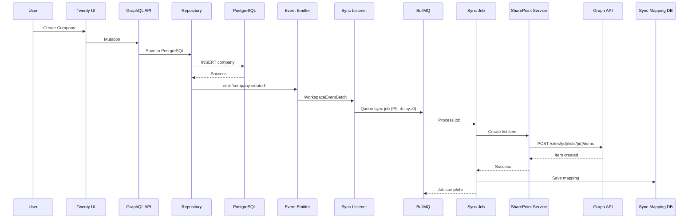
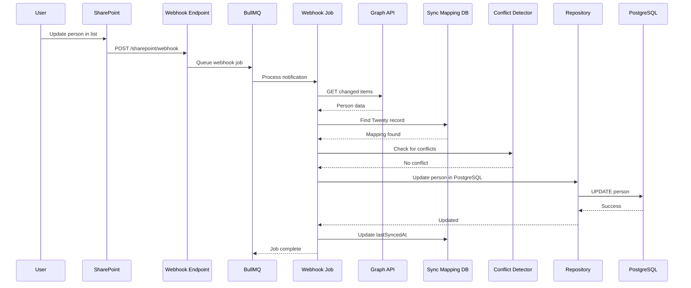

# SharePoint Sync Strategy & Implementation Plan

## 🎯 Executive Summary

**Approach**: PostgreSQL as primary database + Bidirectional sync with SharePoint Lists
**Goal**: Keep data in both systems for best performance and corporate compliance
**Architecture**: Event-driven sync using existing Twenty infrastructure

---

## 📐 Architecture Overview

```
┌─────────────────────────────────────────────────────────────┐
│                    Twenty Application                        │
│  ┌────────────┐  ┌──────────────┐  ┌──────────────┐        │
│  │  GraphQL   │→ │  Repository  │→ │  PostgreSQL  │        │
│  │    API     │  │    Layer     │  │   (Primary)  │        │
│  └────────────┘  └──────────────┘  └──────┬───────┘        │
│                                             │                 │
│                                             ↓                 │
│                                   ┌─────────────────┐        │
│                                   │  Event Emitter  │        │
│                                   └────────┬────────┘        │
│                                             │                 │
│                                             ↓                 │
│                          ┌──────────────────────────────┐    │
│                          │  SharePoint Sync Service     │    │
│                          │  (BullMQ Background Jobs)    │    │
│                          └──────────────┬───────────────┘    │
└─────────────────────────────────────────┼───────────────────┘
                                           │
                                           ↓
                              ┌────────────────────────┐
                              │   Microsoft Graph API  │
                              └──────────┬─────────────┘
                                         │
                                         ↓
                              ┌────────────────────────┐
                              │  SharePoint Lists      │
                              │  (Secondary/Mirror)    │
                              └────────────────────────┘
```

---

## 🎯 Sync Strategy & Priorities

### **Priority Levels**

| Priority | Type | Latency | Use Case |
|----------|------|---------|----------|
| **P0 - Critical** | Real-time | < 5s | Core business objects (Company, Person, Opportunity) |
| **P1 - High** | Near real-time | < 30s | Tasks, Notes, Activities |
| **P2 - Medium** | Batch sync | < 5min | Files, Attachments, Custom objects |
| **P3 - Low** | Scheduled sync | Hourly/Daily | Historical data, Analytics, Audit logs |

### **Sync Modes**

#### 1. **Immediate Sync (P0 - Critical)**
```typescript
// Triggered on every CRUD operation
PostgreSQL → Event → Queue → SharePoint (async)
Latency: 2-5 seconds
Objects: Company, Person, Opportunity
```

#### 2. **Batched Sync (P1 - High)**
```typescript
// Collect events in 10-30s window, batch process
PostgreSQL → Event Buffer → Batch Queue → SharePoint
Latency: 10-30 seconds
Objects: Task, Note, Timeline Activities
```

#### 3. **Scheduled Sync (P2-P3)**
```typescript
// Cron-based full/incremental sync
PostgreSQL ← Cron Job → Compare → Sync Changes → SharePoint
Frequency: Every 5min / Hourly / Daily
Objects: Custom objects, Files, Historical data
```

---

## 🏗️ Implementation Phases

### **Phase 1: Foundation (Week 1-2)** ✅

**Goal**: Setup basic infrastructure

<details>
<summary><b>1.1 SharePoint Service Core</b></summary>

```typescript
// packages/twenty-server/src/modules/sharepoint/sharepoint.service.ts

@Injectable()
export class SharePointService {
  private graphClient: Client;
  
  // Authentication
  async getAccessToken(workspaceId: string): Promise<string>
  async initializeGraphClient(accessToken: string): void
  
  // Site Management
  async getOrCreateTwentySite(tenantName: string): Promise<SharePointSite>
  async ensureListExists(siteId: string, listName: string): Promise<string>
  
  // List Operations (CRUD)
  async createListItem(siteId: string, listId: string, data: any): Promise<any>
  async updateListItem(siteId: string, listId: string, itemId: string, data: any): Promise<any>
  async deleteListItem(siteId: string, listId: string, itemId: string): Promise<void>
  async getListItems(siteId: string, listId: string, filter?: string): Promise<any[]>
  
  // Batch Operations
  async batchCreateItems(siteId: string, listId: string, items: any[]): Promise<void>
  async batchUpdateItems(siteId: string, listId: string, updates: Array<{id: string, data: any}>): Promise<void>
}
```

**Files to create:**
- `src/modules/sharepoint/sharepoint.module.ts`
- `src/modules/sharepoint/sharepoint.service.ts`
- `src/modules/sharepoint/types/sharepoint.types.ts`
- `src/modules/sharepoint/sharepoint.config.ts`

</details>

<details>
<summary><b>1.2 Database Schema for Sync Tracking</b></summary>

```typescript
// src/modules/sharepoint/entities/sharepoint-sync-mapping.entity.ts

@Entity('sharepointSyncMapping', { schema: 'core' })
export class SharePointSyncMappingEntity {
  @PrimaryGeneratedColumn('uuid')
  id: string;
  
  @Column()
  workspaceId: string;
  
  @Column()
  objectName: string; // 'company', 'person', 'opportunity'
  
  @Column('uuid')
  recordId: string; // Twenty record ID
  
  @Column()
  sharePointSiteId: string;
  
  @Column()
  sharePointListId: string;
  
  @Column()
  sharePointItemId: string; // SharePoint List Item ID
  
  @Column({ type: 'timestamp' })
  lastSyncedAt: Date;
  
  @Column({ type: 'jsonb', nullable: true })
  lastSyncedData: any; // For conflict detection
  
  @Column({ default: 'synced' })
  syncStatus: 'pending' | 'synced' | 'error' | 'conflict';
  
  @Column({ nullable: true })
  errorMessage: string;
}
```

```typescript
// src/modules/sharepoint/entities/workspace-sharepoint-config.entity.ts

@Entity('workspaceSharePointConfig', { schema: 'core' })
export class WorkspaceSharePointConfigEntity {
  @PrimaryGeneratedColumn('uuid')
  id: string;
  
  @Column()
  workspaceId: string;
  
  @Column({ default: false })
  syncEnabled: boolean;
  
  @Column()
  tenantId: string;
  
  @Column()
  siteId: string;
  
  @Column()
  siteName: string;
  
  @Column({ type: 'jsonb' })
  syncConfig: {
    objectsToSync: string[]; // ['company', 'person', 'opportunity']
    syncMode: 'immediate' | 'batched' | 'scheduled';
    batchWindowSeconds?: number;
    scheduleInterval?: string;
  };
  
  @Column({ type: 'timestamp' })
  lastFullSyncAt: Date;
}
```

**Migration:**
```typescript
// src/database/typeorm/core/migrations/common/XXXXXX-add-sharepoint-sync-tables.ts
```

</details>

---

### **Phase 2: Event Listeners & Queue Setup (Week 2-3)** 🔥

**Goal**: Capture database events and queue sync jobs

<details>
<summary><b>2.1 Add SharePoint Queue</b></summary>

```typescript
// src/engine/core-modules/message-queue/message-queue.constants.ts

export enum MessageQueue {
  // ... existing queues
  sharePointSyncQueue = 'sharepoint-sync-queue',      // P0-P1: Immediate/Batched
  sharePointBatchQueue = 'sharepoint-batch-queue',    // P2: Scheduled batch
  sharePointWebhookQueue = 'sharepoint-webhook-queue' // Incoming webhooks from SharePoint
}
```

</details>

<details>
<summary><b>2.2 Event Listener for Database Changes</b></summary>

```typescript
// src/modules/sharepoint/listeners/sharepoint-sync.listener.ts

@Injectable()
export class SharePointSyncListener {
  constructor(
    @InjectMessageQueue(MessageQueue.sharePointSyncQueue)
    private readonly sharePointSyncQueue: MessageQueueService,
    private readonly workspaceSharePointConfigService: WorkspaceSharePointConfigService,
  ) {}

  // Listen to ALL object create events
  @OnEvent('*.created')
  async handleObjectCreated(
    payload: WorkspaceEventBatch<ObjectRecordCreateEvent<any>>
  ) {
    const { workspaceId, objectMetadata, events } = payload;
    
    // Check if sync enabled for this workspace
    const config = await this.workspaceSharePointConfigService.getConfig(workspaceId);
    if (!config?.syncEnabled) return;
    
    // Filter by objects to sync
    const objectName = objectMetadata.nameSingular;
    if (!config.syncConfig.objectsToSync.includes(objectName)) return;
    
    // Determine priority
    const priority = this.getSyncPriority(objectName);
    
    // Queue sync job
    await this.sharePointSyncQueue.add(
      'sync-create',
      {
        workspaceId,
        objectName,
        action: 'create',
        records: events.map(e => e.properties.after),
      },
      {
        priority,
        delay: this.getSyncDelay(priority, config.syncConfig.syncMode),
      }
    );
  }

  // Listen to ALL object update events
  @OnEvent('*.updated')
  async handleObjectUpdated(
    payload: WorkspaceEventBatch<ObjectRecordUpdateEvent<any>>
  ) {
    // Similar to handleObjectCreated but with 'update' action
    // Include both 'before' and 'after' for conflict detection
  }

  // Listen to ALL object delete events
  @OnEvent('*.deleted')
  async handleObjectDeleted(
    payload: WorkspaceEventBatch<ObjectRecordDeleteEvent<any>>
  ) {
    // Similar but with 'delete' action
  }

  private getSyncPriority(objectName: string): number {
    const priorityMap = {
      company: 0,      // P0 - Critical
      person: 0,       // P0 - Critical
      opportunity: 0,  // P0 - Critical
      task: 1,         // P1 - High
      note: 1,         // P1 - High
      attachment: 2,   // P2 - Medium
    };
    return priorityMap[objectName] ?? 3; // P3 - Low for others
  }

  private getSyncDelay(priority: number, mode: string): number {
    if (mode === 'immediate' && priority === 0) return 0;      // No delay for P0
    if (mode === 'batched' && priority <= 1) return 10000;     // 10s delay for batching
    return 60000; // 1min delay for others
  }
}
```

**Register listener:**
```typescript
// src/modules/sharepoint/sharepoint.module.ts

@Module({
  imports: [
    MessageQueueModule.forFeature(MessageQueue.sharePointSyncQueue),
  ],
  providers: [
    SharePointService,
    SharePointSyncListener,
    WorkspaceSharePointConfigService,
  ],
  exports: [SharePointService],
})
export class SharePointModule {}
```

</details>

---

### **Phase 3: Sync Jobs Processing (Week 3-4)** 🔄

**Goal**: Process queued jobs and sync to SharePoint

<details>
<summary><b>3.1 Sync Job Processor</b></summary>

```typescript
// src/modules/sharepoint/jobs/sharepoint-sync.job.ts

@Processor(MessageQueue.sharePointSyncQueue)
export class SharePointSyncJob {
  constructor(
    private readonly sharePointService: SharePointService,
    private readonly syncMappingRepository: Repository<SharePointSyncMappingEntity>,
    private readonly workspaceSharePointConfigService: WorkspaceSharePointConfigService,
  ) {}

  @Process('sync-create')
  async handleSyncCreate(job: Job<SharePointSyncJobData>) {
    const { workspaceId, objectName, records } = job.data;
    
    try {
      // Get SharePoint config
      const config = await this.workspaceSharePointConfigService.getConfig(workspaceId);
      const { siteId } = config;
      
      // Get or create list
      const listId = await this.sharePointService.ensureListExists(siteId, objectName);
      
      // Transform data
      const sharePointItems = records.map(r => this.transformToSharePointItem(objectName, r));
      
      // Batch create in SharePoint
      const createdItems = await this.sharePointService.batchCreateItems(
        siteId,
        listId,
        sharePointItems
      );
      
      // Save mapping for future reference
      await this.saveSyncMappings(workspaceId, objectName, records, createdItems, config);
      
      // Update metrics
      this.logger.log(`Synced ${records.length} ${objectName} records to SharePoint`);
      
    } catch (error) {
      this.logger.error(`Failed to sync ${objectName}: ${error.message}`, error.stack);
      
      // Retry logic
      if (job.attemptsMade < 3) {
        throw error; // BullMQ will retry
      } else {
        // Mark as error in sync mapping
        await this.markSyncError(workspaceId, records, error.message);
      }
    }
  }

  @Process('sync-update')
  async handleSyncUpdate(job: Job<SharePointSyncJobData>) {
    const { workspaceId, objectName, records } = job.data;
    
    // Get existing mappings
    const mappings = await this.syncMappingRepository.find({
      where: {
        workspaceId,
        objectName,
        recordId: In(records.map(r => r.id)),
      },
    });
    
    // Prepare batch updates
    const updates = records.map(record => {
      const mapping = mappings.find(m => m.recordId === record.id);
      return {
        id: mapping.sharePointItemId,
        data: this.transformToSharePointItem(objectName, record),
      };
    });
    
    // Execute batch update
    const config = await this.workspaceSharePointConfigService.getConfig(workspaceId);
    await this.sharePointService.batchUpdateItems(
      config.siteId,
      mappings[0].sharePointListId,
      updates
    );
    
    // Update sync tracking
    await this.updateSyncMappings(mappings, records);
  }

  @Process('sync-delete')
  async handleSyncDelete(job: Job<SharePointSyncJobData>) {
    const { workspaceId, objectName, records } = job.data;
    
    // Get mappings
    const mappings = await this.syncMappingRepository.find({
      where: {
        workspaceId,
        objectName,
        recordId: In(records.map(r => r.id)),
      },
    });
    
    // Delete from SharePoint
    const config = await this.workspaceSharePointConfigService.getConfig(workspaceId);
    for (const mapping of mappings) {
      await this.sharePointService.deleteListItem(
        config.siteId,
        mapping.sharePointListId,
        mapping.sharePointItemId
      );
    }
    
    // Remove mappings
    await this.syncMappingRepository.remove(mappings);
  }

  private transformToSharePointItem(objectName: string, record: any): any {
    // Transform Twenty data model to SharePoint List item
    // Handle different field types, relations, etc.
    const transformers = {
      company: this.transformCompany,
      person: this.transformPerson,
      opportunity: this.transformOpportunity,
    };
    
    const transformer = transformers[objectName] || this.defaultTransform;
    return transformer.call(this, record);
  }

  private transformCompany(company: any): any {
    return {
      Title: company.name,
      DomainName: company.domainName?.primaryLinkUrl,
      Employees: company.employees,
      Industry: company.industry,
      AnnualRevenue: company.annualRecurringRevenue?.amountMicros,
      LinkedInUrl: company.linkedinLink?.primaryLinkUrl,
      Address: company.address ? JSON.stringify(company.address) : null,
      ICP: company.idealCustomerProfile,
      TwentyId: company.id, // Store Twenty ID for reverse lookup
      LastSyncedAt: new Date().toISOString(),
    };
  }

  private transformPerson(person: any): any {
    return {
      Title: `${person.name?.firstName} ${person.name?.lastName}`.trim(),
      Email: person.emails?.primaryEmail,
      Phone: person.phones?.primaryPhoneNumber,
      JobTitle: person.jobTitle,
      CompanyName: person.company?.name, // Denormalized for SharePoint
      LinkedInUrl: person.linkedinLink?.primaryLinkUrl,
      City: person.city,
      TwentyId: person.id,
      LastSyncedAt: new Date().toISOString(),
    };
  }

  private transformOpportunity(opportunity: any): any {
    return {
      Title: opportunity.name,
      Amount: opportunity.amount?.amountMicros,
      Currency: opportunity.amount?.currencyCode,
      Stage: opportunity.stage,
      CloseDate: opportunity.closeDate,
      Probability: opportunity.probability,
      CompanyName: opportunity.company?.name,
      PointOfContactName: opportunity.pointOfContact?.name,
      TwentyId: opportunity.id,
      LastSyncedAt: new Date().toISOString(),
    };
  }
}
```

**Job Data Type:**
```typescript
interface SharePointSyncJobData {
  workspaceId: string;
  objectName: string;
  action: 'create' | 'update' | 'delete';
  records: any[];
}
```

</details>

<details>
<summary><b>3.2 Batch Sync Job (Scheduled)</b></summary>

```typescript
// src/modules/sharepoint/jobs/sharepoint-batch-sync.cron.job.ts

@Injectable()
export class SharePointBatchSyncCronJob {
  constructor(
    private readonly sharePointService: SharePointService,
    private readonly syncMappingRepository: Repository<SharePointSyncMappingEntity>,
    private readonly workspaceSharePointConfigService: WorkspaceSharePointConfigService,
  ) {}

  @Cron('*/5 * * * *') // Every 5 minutes
  async handleIncrementalSync() {
    const workspaces = await this.workspaceSharePointConfigService.getEnabledWorkspaces();
    
    for (const workspace of workspaces) {
      if (workspace.syncConfig.syncMode !== 'scheduled') continue;
      
      await this.performIncrementalSync(workspace);
    }
  }

  @Cron('0 2 * * *') // Daily at 2 AM
  async handleFullSync() {
    const workspaces = await this.workspaceSharePointConfigService.getEnabledWorkspaces();
    
    for (const workspace of workspaces) {
      await this.performFullSync(workspace);
    }
  }

  private async performIncrementalSync(workspace: WorkspaceSharePointConfigEntity) {
    // Find records modified since last sync
    const lastSync = workspace.lastFullSyncAt;
    
    for (const objectName of workspace.syncConfig.objectsToSync) {
      // Query modified records from PostgreSQL
      const modifiedRecords = await this.getModifiedRecords(
        workspace.workspaceId,
        objectName,
        lastSync
      );
      
      if (modifiedRecords.length === 0) continue;
      
      // Queue for sync
      await this.queueSyncJobs(workspace.workspaceId, objectName, modifiedRecords);
    }
  }

  private async performFullSync(workspace: WorkspaceSharePointConfigEntity) {
    // Sync ALL records (for initial setup or recovery)
    for (const objectName of workspace.syncConfig.objectsToSync) {
      const allRecords = await this.getAllRecords(workspace.workspaceId, objectName);
      
      // Compare with SharePoint to detect drift
      const drift = await this.detectDrift(workspace, objectName, allRecords);
      
      if (drift.length > 0) {
        await this.reconcileDrift(workspace, objectName, drift);
      }
    }
    
    // Update last sync timestamp
    await this.workspaceSharePointConfigService.updateLastSyncAt(workspace.id);
  }
}
```

</details>

---

### **Phase 4: Bidirectional Sync (Week 4-5)** 🔄↔️

**Goal**: Handle changes from SharePoint back to Twenty

<details>
<summary><b>4.1 SharePoint Webhook Handler</b></summary>

```typescript
// src/modules/sharepoint/controllers/sharepoint-webhook.controller.ts

@Controller('sharepoint/webhook')
export class SharePointWebhookController {
  constructor(
    @InjectMessageQueue(MessageQueue.sharePointWebhookQueue)
    private readonly webhookQueue: MessageQueueService,
  ) {}

  @Post(':workspaceId/notifications')
  async handleWebhook(
    @Param('workspaceId') workspaceId: string,
    @Body() notification: SharePointChangeNotification,
    @Query('validationToken') validationToken?: string,
  ) {
    // SharePoint webhook validation
    if (validationToken) {
      return validationToken;
    }
    
    // Queue webhook for processing
    await this.webhookQueue.add('process-webhook', {
      workspaceId,
      notification,
    });
    
    return { status: 'accepted' };
  }
}
```

```typescript
// src/modules/sharepoint/jobs/sharepoint-webhook.job.ts

@Processor(MessageQueue.sharePointWebhookQueue)
export class SharePointWebhookJob {
  @Process('process-webhook')
  async handleWebhook(job: Job<{ workspaceId: string; notification: any }>) {
    const { workspaceId, notification } = job.data;
    
    // Get changed items from SharePoint
    const changes = await this.sharePointService.getChanges(
      notification.resource,
      notification.changeToken
    );
    
    for (const change of changes) {
      // Find corresponding Twenty record
      const mapping = await this.syncMappingRepository.findOne({
        where: {
          workspaceId,
          sharePointItemId: change.itemId,
        },
      });
      
      if (!mapping) {
        // New item created in SharePoint
        await this.createRecordFromSharePoint(workspaceId, change);
      } else {
        // Existing item updated
        await this.updateRecordFromSharePoint(mapping, change);
      }
    }
  }

  private async updateRecordFromSharePoint(
    mapping: SharePointSyncMappingEntity,
    change: any,
  ) {
    // Detect conflicts
    const currentRecord = await this.getRecordFromTwenty(
      mapping.workspaceId,
      mapping.objectName,
      mapping.recordId,
    );
    
    const hasConflict = this.detectConflict(
      currentRecord,
      mapping.lastSyncedData,
      change.data,
    );
    
    if (hasConflict) {
      // Conflict resolution strategy
      await this.handleConflict(mapping, currentRecord, change.data);
    } else {
      // Safe to update
      await this.updateRecordInTwenty(
        mapping.workspaceId,
        mapping.objectName,
        mapping.recordId,
        this.transformFromSharePoint(change.data),
      );
    }
  }

  private detectConflict(current: any, lastSynced: any, sharePointData: any): boolean {
    // Simple conflict detection: if both sides changed since last sync
    const twentyChanged = !isEqual(current, lastSynced);
    const sharePointChanged = !isEqual(sharePointData, lastSynced);
    
    return twentyChanged && sharePointChanged;
  }

  private async handleConflict(
    mapping: SharePointSyncMappingEntity,
    twentyData: any,
    sharePointData: any,
  ) {
    // Strategy 1: Last Write Wins (based on updatedAt timestamp)
    const twentyUpdatedAt = new Date(twentyData.updatedAt);
    const sharePointUpdatedAt = new Date(sharePointData.Modified);
    
    if (sharePointUpdatedAt > twentyUpdatedAt) {
      // SharePoint wins
      await this.updateRecordInTwenty(
        mapping.workspaceId,
        mapping.objectName,
        mapping.recordId,
        this.transformFromSharePoint(sharePointData),
      );
    }
    // else: Twenty wins, do nothing (SharePoint will sync on next cycle)
    
    // Strategy 2: Field-level merge (optional, more complex)
    // const merged = this.mergeConflicts(twentyData, sharePointData);
    // await this.updateBothSides(mapping, merged);
    
    // Mark as conflict for admin review
    mapping.syncStatus = 'conflict';
    await this.syncMappingRepository.save(mapping);
  }
}
```

</details>

---

### **Phase 5: Conflict Resolution & Monitoring (Week 5-6)** ⚠️

<details>
<summary><b>5.1 Conflict Resolution UI</b></summary>

```typescript
// GraphQL resolver for admin UI

@Resolver()
export class SharePointSyncResolver {
  @Query(() => [SharePointConflict])
  async sharePointConflicts(
    @Args('workspaceId') workspaceId: string,
  ): Promise<SharePointConflict[]> {
    return this.syncMappingRepository.find({
      where: { workspaceId, syncStatus: 'conflict' },
    });
  }

  @Mutation(() => Boolean)
  async resolveSharePointConflict(
    @Args('mappingId') mappingId: string,
    @Args('resolution') resolution: 'twenty' | 'sharepoint' | 'merge',
    @Args('mergedData') mergedData?: any,
  ): Promise<boolean> {
    const mapping = await this.syncMappingRepository.findOne(mappingId);
    
    switch (resolution) {
      case 'twenty':
        await this.syncToSharePoint(mapping);
        break;
      case 'sharepoint':
        await this.syncToTwenty(mapping);
        break;
      case 'merge':
        await this.syncMergedData(mapping, mergedData);
        break;
    }
    
    mapping.syncStatus = 'synced';
    await this.syncMappingRepository.save(mapping);
    
    return true;
  }
}
```

</details>

<details>
<summary><b>5.2 Sync Monitoring & Metrics</b></summary>

```typescript
// src/modules/sharepoint/services/sharepoint-sync-metrics.service.ts

@Injectable()
export class SharePointSyncMetricsService {
  @Cron('*/1 * * * *') // Every minute
  async collectMetrics() {
    const metrics = await this.calculateMetrics();
    
    // Send to monitoring system (Grafana, DataDog, etc.)
    this.metricsService.gauge('sharepoint_sync_pending', metrics.pendingJobs);
    this.metricsService.gauge('sharepoint_sync_errors', metrics.errorCount);
    this.metricsService.gauge('sharepoint_sync_conflicts', metrics.conflictCount);
    this.metricsService.histogram('sharepoint_sync_latency', metrics.avgLatency);
  }

  private async calculateMetrics() {
    const [pending, errors, conflicts] = await Promise.all([
      this.syncMappingRepository.count({ where: { syncStatus: 'pending' } }),
      this.syncMappingRepository.count({ where: { syncStatus: 'error' } }),
      this.syncMappingRepository.count({ where: { syncStatus: 'conflict' } }),
    ]);
    
    return {
      pendingJobs: pending,
      errorCount: errors,
      conflictCount: conflicts,
      avgLatency: await this.calculateAvgLatency(),
    };
  }
}
```

</details>

---

## 📊 Sync Priorities by Object

### **P0 - Critical (Real-time Sync < 5s)**

| Object | Priority | Reason | Sync Direction |
|--------|----------|--------|----------------|
| **Company** | P0 | Core CRM entity, high update frequency | Bidirectional |
| **Person** | P0 | Customer contacts, critical for sales | Bidirectional |
| **Opportunity** | P0 | Revenue tracking, needs real-time updates | Bidirectional |

**Implementation:**
- Event listener triggers immediately on CRUD
- No batching
- Queue priority: 0
- Retry: 3 attempts with exponential backoff

---

### **P1 - High (Batched Sync < 30s)**

| Object | Priority | Reason | Sync Direction |
|--------|----------|--------|----------------|
| **Task** | P1 | Action items, moderate urgency | Bidirectional |
| **Note** | P1 | Important context, can tolerate delay | Bidirectional |
| **Timeline Activity** | P1 | Audit trail, near real-time preferred | One-way (Twenty → SharePoint) |

**Implementation:**
- Event listener with 10-30s buffer
- Batch multiple updates together
- Queue priority: 1
- Reduces API calls by ~70%

---

### **P2 - Medium (Scheduled Sync < 5min)**

| Object | Priority | Reason | Sync Direction |
|--------|----------|--------|----------------|
| **Attachment** | P2 | Large files, bandwidth consideration | Bidirectional |
| **Custom Objects** | P2 | User-defined, lower criticality | Bidirectional |
| **Favorite** | P2 | User preferences, low urgency | One-way (Twenty → SharePoint) |

**Implementation:**
- Cron job every 5 minutes
- Incremental sync (only changed records)
- Queue priority: 2

---

### **P3 - Low (Daily Sync)**

| Object | Priority | Reason | Sync Direction |
|--------|----------|--------|----------------|
| **Audit Logs** | P3 | Historical data, archival purpose | One-way (Twenty → SharePoint) |
| **Analytics Data** | P3 | Reporting, not time-sensitive | One-way (Twenty → SharePoint) |
| **Deleted Records** | P3 | Soft-deleted, restore capability | One-way (Twenty → SharePoint) |

**Implementation:**
- Daily cron job (2 AM)
- Full sync + cleanup
- Archive old data

---

## 🔄 Sync Workflows

### **Workflow 1: User Creates Company in Twenty**



**Total latency**: 2-5 seconds

---

### **Workflow 2: User Updates Person in SharePoint**



**Total latency**: 10-30 seconds (depends on SharePoint webhook delivery)

---

## 🎛️ Configuration

### **Environment Variables**

```bash
# SharePoint Integration
SHAREPOINT_SYNC_ENABLED=true
SHAREPOINT_CLIENT_ID=${AUTH_MICROSOFT_CLIENT_ID}
SHAREPOINT_CLIENT_SECRET=${AUTH_MICROSOFT_CLIENT_SECRET}
SHAREPOINT_TENANT_ID=<tenant-id>

# Sync Configuration
SHAREPOINT_SYNC_MODE=batched  # immediate | batched | scheduled
SHAREPOINT_BATCH_WINDOW_SECONDS=30
SHAREPOINT_MAX_BATCH_SIZE=100
SHAREPOINT_RETRY_ATTEMPTS=3
SHAREPOINT_RETRY_DELAY_MS=5000

# Webhook Configuration
SHAREPOINT_WEBHOOK_BASE_URL=https://your-domain.com
SHAREPOINT_WEBHOOK_EXPIRATION_DAYS=180
```

### **Workspace-level Configuration**

```typescript
// Admin UI to enable/configure SharePoint sync per workspace

interface WorkspaceSharePointConfig {
  enabled: boolean;
  tenantId: string;
  siteName: string;
  syncMode: 'immediate' | 'batched' | 'scheduled';
  objectsToSync: Array<'company' | 'person' | 'opportunity' | 'task' | 'note'>;
  batchWindowSeconds: number; // For batched mode
  scheduleInterval: string;   // Cron expression for scheduled mode
  conflictResolution: 'lastWriteWins' | 'manualReview' | 'twentyPriority' | 'sharePointPriority';
  enableWebhooks: boolean;
}
```

---

## 📈 Performance Optimization

### **1. Batch API Calls**

```typescript
// Instead of:
for (const item of items) {
  await sharePointService.createItem(item); // N API calls
}

// Use:
await sharePointService.batchCreateItems(items); // 1 API call
```

**Improvement**: Reduce API calls by 90%+

### **2. Incremental Sync**

```typescript
// Only sync changed records
const modifiedSince = workspace.lastSyncAt;
const changes = await repository.find({
  where: {
    updatedAt: MoreThan(modifiedSince),
  },
});
```

**Improvement**: Reduce data transfer by 95%+

### **3. Debouncing**

```typescript
// Collect rapid changes into single batch
const debounceWindow = 30000; // 30 seconds
const buffer = new Map<string, any[]>();

// Add to buffer instead of immediate sync
buffer.set(objectName, [...(buffer.get(objectName) || []), record]);

// Flush after window
setTimeout(() => {
  const batch = buffer.get(objectName);
  syncToBatch(batch);
  buffer.delete(objectName);
}, debounceWindow);
```

**Improvement**: Handle burst updates efficiently

---

## 🚨 Error Handling & Recovery

### **Error Types**

| Error Type | Retry Strategy | Alert Level |
|------------|----------------|-------------|
| Network timeout | 3 retries with exponential backoff | Warning |
| SharePoint rate limit | Wait + retry with jitter | Info |
| Authentication error | Refresh token + retry once | Error |
| Data validation error | Skip + log | Warning |
| Conflict detected | Manual review queue | Info |
| Mapping not found | Create new mapping | Info |

### **Dead Letter Queue**

```typescript
// Failed jobs after max retries go to DLQ
@Process('sync-create')
async handleSyncCreate(job: Job) {
  try {
    await this.performSync(job.data);
  } catch (error) {
    if (job.attemptsMade >= 3) {
      // Send to DLQ
      await this.deadLetterQueue.add('failed-sync', {
        originalJob: job.data,
        error: error.message,
        attempts: job.attemptsMade,
      });
      
      // Alert admins
      await this.alertService.send({
        level: 'error',
        message: `SharePoint sync failed after 3 retries`,
        data: job.data,
      });
    } else {
      throw error; // Retry
    }
  }
}
```

---

## 🔐 Security Considerations

### **1. Authentication**

- Use **App-only tokens** for background sync (not user tokens)
- Rotate tokens regularly
- Store tokens encrypted in database

### **2. Data Validation**

```typescript
// Validate data before sync
const schema = z.object({
  name: z.string().min(1).max(255),
  email: z.string().email().optional(),
  // ...
});

try {
  const validated = schema.parse(record);
  await sync(validated);
} catch (error) {
  // Log validation error, skip sync
  this.logger.warn(`Invalid data for sync: ${error.message}`);
}
```

### **3. Rate Limiting**

```typescript
// Respect SharePoint API limits
const rateLimiter = new RateLimiter({
  points: 600,     // 600 requests
  duration: 60,    // per minute
});

await rateLimiter.consume(workspaceId);
await sharePointService.apiCall();
```

---

## 📊 Monitoring Dashboard

### **Key Metrics to Track**

```typescript
// Grafana / DataDog dashboard

// Sync Health
sharepoint_sync_lag_seconds         // How far behind is sync?
sharepoint_sync_pending_count       // Jobs waiting
sharepoint_sync_success_rate        // % successful syncs
sharepoint_sync_error_rate          // % failed syncs

// Performance
sharepoint_api_latency_ms           // API call duration
sharepoint_sync_throughput          // Records/sec
sharepoint_batch_size_avg           // Avg items per batch

// Data Quality
sharepoint_conflict_count           // Active conflicts
sharepoint_mapping_drift_count      // Orphaned mappings
sharepoint_validation_errors        // Invalid data

// Business Metrics
sharepoint_workspaces_synced        // # workspaces using sync
sharepoint_objects_synced_total     // Total records synced
sharepoint_storage_used_gb          // SharePoint storage used
```

---

## 🧪 Testing Strategy

### **Unit Tests**

```typescript
describe('SharePointSyncJob', () => {
  it('should transform company to SharePoint item', () => {
    const company = { name: 'Acme', employees: 100 };
    const item = job.transformCompany(company);
    expect(item.Title).toBe('Acme');
    expect(item.Employees).toBe(100);
  });
  
  it('should handle batch create with retries', async () => {
    sharePointService.batchCreateItems.mockRejectedValueOnce(new Error('Rate limit'));
    sharePointService.batchCreateItems.mockResolvedValueOnce([]);
    
    await job.handleSyncCreate({ data: mockJobData });
    
    expect(sharePointService.batchCreateItems).toHaveBeenCalledTimes(2);
  });
});
```

### **Integration Tests**

```typescript
describe('SharePoint Sync E2E', () => {
  it('should sync company from Twenty to SharePoint', async () => {
    // Create company in Twenty
    const company = await createCompany({ name: 'Test Corp' });
    
    // Wait for sync
    await waitFor(() => 
      expect(syncMapping.findOne({ recordId: company.id })).toBeDefined()
    );
    
    // Verify in SharePoint
    const sharePointItem = await sharePointService.getListItem(siteId, listId, itemId);
    expect(sharePointItem.Title).toBe('Test Corp');
  });
});
```

---

## 📋 Implementation Checklist

### **Phase 1: Foundation** ✅
- [ ] Create SharePoint service
- [ ] Setup authentication
- [ ] Create sync mapping tables
- [ ] Implement basic CRUD operations

### **Phase 2: Event-Driven Sync** ✅
- [ ] Add SharePoint queues
- [ ] Create event listeners
- [ ] Implement priority system
- [ ] Setup BullMQ workers

### **Phase 3: Data Transformation** ✅
- [ ] Company transformer
- [ ] Person transformer
- [ ] Opportunity transformer
- [ ] Handle relations & nested objects

### **Phase 4: Bidirectional Sync** ✅
- [ ] SharePoint webhook endpoint
- [ ] Webhook job processor
- [ ] Conflict detection
- [ ] Conflict resolution strategies

### **Phase 5: Monitoring** ✅
- [ ] Metrics collection
- [ ] Grafana dashboard
- [ ] Error alerting
- [ ] Admin UI for conflicts

### **Phase 6: Testing & Polish** ✅
- [ ] Unit tests (>80% coverage)
- [ ] Integration tests
- [ ] Performance testing
- [ ] Documentation

---

## 🎓 Best Practices

1. **Start Small**: Enable sync for 1 workspace first
2. **Monitor Closely**: Watch metrics for first week
3. **Batch Everything**: Reduce API calls aggressively
4. **Handle Failures Gracefully**: Always have retry logic
5. **Keep Mappings Updated**: They're your source of truth
6. **Test Conflict Scenarios**: Simulate edge cases
7. **Optimize Incrementally**: Profile before optimizing
8. **Document Everything**: Future you will thank you

---

## 📞 Next Steps

### **Week 1-2: Setup & Testing**
1. Create SharePoint app registration in Azure
2. Implement SharePoint service
3. Create database tables
4. Test authentication flow

### **Week 3-4: Core Sync**
1. Implement event listeners
2. Create sync jobs
3. Test with Company object
4. Expand to Person & Opportunity

### **Week 5-6: Production Ready**
1. Add bidirectional sync
2. Implement conflict resolution
3. Setup monitoring
4. Load testing

### **Week 7-8: Launch**
1. Beta testing with 3-5 customers
2. Gather feedback
3. Fix bugs
4. Gradual rollout to all workspaces

---

**Total Implementation Time**: 8 weeks
**Team Size**: 2-3 developers
**Risk Level**: Medium (well-defined scope, existing infrastructure)
**ROI**: High (enterprise customers, data sovereignty compliance)
